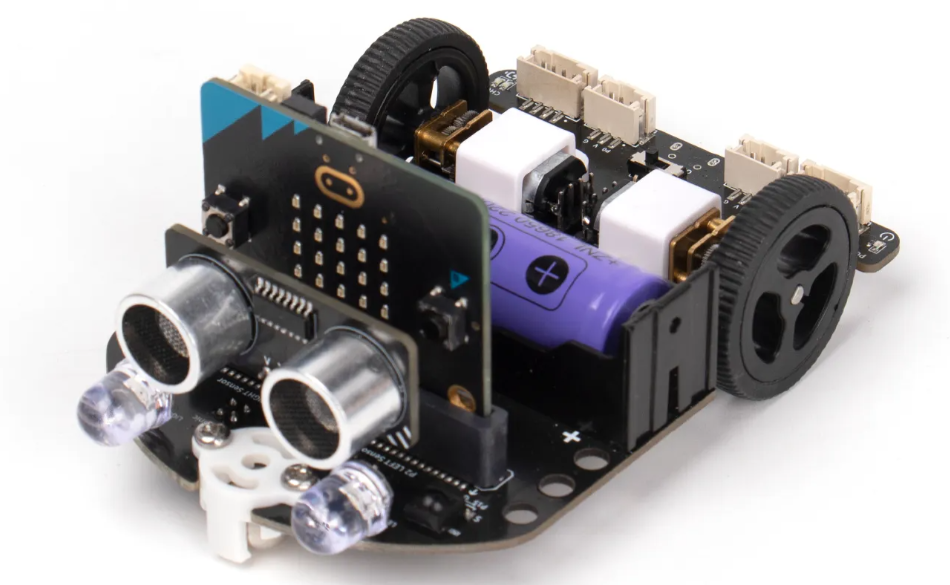
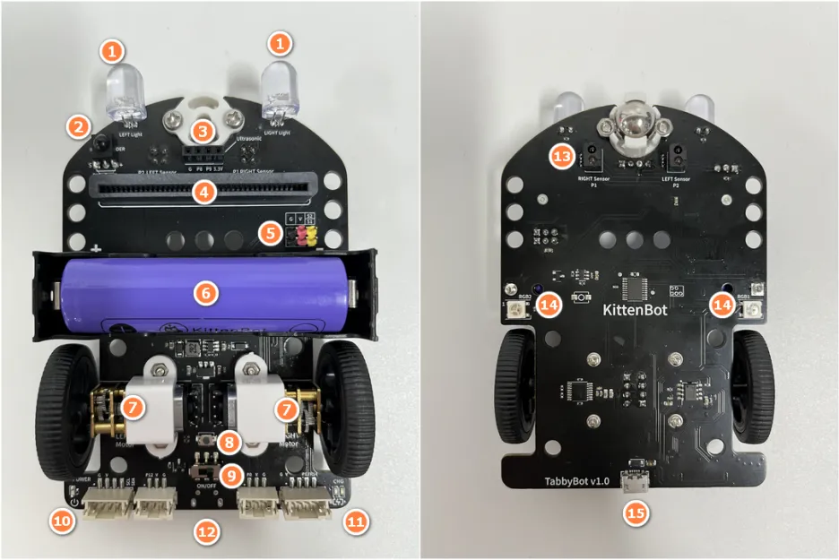

## Introduction

This is a fully integrated and feature-rich STEM car for Microbit. It utilizes an 18650 lithium battery, providing ample power to drive power-hungry modules such as AI camera modules or voice recognition modules, without the need for multiple dry cell batteries. It comes with a built-in charging and discharging circuit, offering convenient usage.

The car offers programmable resources including LEDs, RGB lights, line tracking sensors, infrared receivers, ultrasonic sensors, servo motor drivers, and motor drivers. Additionally, it has four programming interfaces for expanding with more sensors.

The board features LEGO-compatible mounting holes, allowing for the installation of LEGO structural components for expansion purposes.


[Purchase link](https://www.kittenbot.cc/products/kittenbot-tabbybot-programming-robotics-kit)

[Tutorial Links](https://learn.kittenbot.cc/docs/TabbyBot/01QuickStart)


## Overview




1. Front headlights x2
2. Infrared receiver sensor
3. Ultrasonic interface
4. Microbit slot
5. Servo motor interfaces S1, S2
6. 18650 battery compartment
7. N20 geared motors x2
8. Short circuit recovery button
9. Power switch
10. Power indicator light
11. Charging indicator light (blue during charging, green when fully charged)
12. Expansion programming interfaces (P0, P12, I2C, and Serial Port)
13. Line-following sensors x2
14. WS2812 RGB LEDs x2
15. USB charging interface
16. The car also has 13 round holes for attaching LEGO pins.

## Basic usage

Usage: turning on/off the headlights,adjusting the brightness of the headlights

```blocks
input.onButtonPressed(Button.A, function () {
    tabbyRobot.headLights(100, 0)
})
input.onButtonPressed(Button.B, function () {
    tabbyRobot.headLights(0, 100)
})
for (let index = 0; index < 4; index++) {
    tabbyRobot.headlightsOnOffControl(true, false)
    basic.pause(1000)
    tabbyRobot.headlightsOnOffControl(false, true)
    basic.pause(1000)
}
for (let index = 0; index < 4; index++) {
    tabbyRobot.headLightsAll(true)
    basic.pause(1000)
    tabbyRobot.headLightsAll(false)
    basic.pause(1000)
}
```

Usage: RGB

```blocks
tabbyRobot.setRgbBrightness(50)
tabbyRobot.rgbShowColor(tabbyRobot.RGBColors.Red)
basic.pause(500)
tabbyRobot.rgbShowColor(tabbyRobot.RGBColors.Green)
basic.pause(500)
tabbyRobot.rgbShowColor(tabbyRobot.RGBColors.Blue)
basic.pause(500)
basic.forever(function () {
    tabbyRobot.clearAllRgb()
    tabbyRobot.setIndexColor(1, tabbyRobot.RGBColors.White)
    basic.pause(1000)
    tabbyRobot.clearAllRgb()
    tabbyRobot.setIndexColor(2, tabbyRobot.RGBColors.White)
    basic.pause(1000)
})
```

Usage: motors and servos

```blocks
input.onButtonPressed(Button.A, function () {
    tabbyRobot.servoSet(tabbyRobot.ServoList.S1, 0)
    tabbyRobot.servoSet(tabbyRobot.ServoList.S2, 0)
})
input.onButtonPressed(Button.B, function () {
    tabbyRobot.servoSet(tabbyRobot.ServoList.S1, 180)
    tabbyRobot.servoSet(tabbyRobot.ServoList.S2, 180)
})
basic.forever(function () {
    tabbyRobot.motorRun(30, 0)
    basic.pause(1000)
    tabbyRobot.motorRun(-30, 0)
    basic.pause(1000)
    tabbyRobot.motorRun(0, 30)
    basic.pause(1000)
    tabbyRobot.motorRun(0, -30)
    basic.pause(1000)
    tabbyRobot.motorStop()
})

```

Usage: Line-following car

```blocks
input.onButtonPressed(Button.A, function () {
    flag = !(flag)
})
let flag = false
let leftSensor = 0
let rightSensor = 0
let lineThreshold = 500
flag = false
basic.forever(function () {
    leftSensor = tabbyRobot.line(tabbyRobot.LeftRight.Left)
    rightSensor = tabbyRobot.line(tabbyRobot.LeftRight.Right)
    if (flag) {
        if (leftSensor >= lineThreshold && rightSensor >= lineThreshold) {
            tabbyRobot.motorRun(30, 30)
        } else if (leftSensor < lineThreshold && rightSensor >= lineThreshold) {
            tabbyRobot.motorRun(30, 60)
        } else if (leftSensor >= lineThreshold && rightSensor < lineThreshold) {
            tabbyRobot.motorRun(60, 20)
        } else {
            tabbyRobot.motorStop()
        }
    } else {
        tabbyRobot.motorStop()
    }
})

```

Usage: ultrasonic car

```blocks
input.onButtonPressed(Button.A, function () {
    runFlag = !(runFlag)
    if (runFlag) {
        music._playDefaultBackground(music.builtInPlayableMelody(Melodies.PowerUp), music.PlaybackMode.InBackground)
        basic.showIcon(IconNames.Yes)
    } else {
        music._playDefaultBackground(music.builtInPlayableMelody(Melodies.PowerDown), music.PlaybackMode.InBackground)
        basic.showIcon(IconNames.No)
    }
})
let runFlag = false
runFlag = false
basic.showIcon(IconNames.No)
basic.forever(function () {
    if (runFlag) {
        if (tabbyRobot.ultrasonic() < 15) {
            tabbyRobot.motorStop()
            tabbyRobot.rgbShowColor(tabbyRobot.RGBColors.Red)
            music.play(music.tonePlayable(262, music.beat(BeatFraction.Whole)), music.PlaybackMode.UntilDone)
            basic.pause(100)
            tabbyRobot.motorRun(-20, -20)
            tabbyRobot.motorRun(-50, 50)
            basic.pause(100)
        } else {
            tabbyRobot.rgbShowColor(tabbyRobot.RGBColors.White)
            tabbyRobot.motorRun(50, 50)
        }
    } else {
        tabbyRobot.motorStop()
    }
})
```

Usage: Ultrasonic

```blocks
let Distance = 0
basic.forever(function () {
    Distance = tabbyRobot.ultrasonic()
    serial.writeValue("Distance", Distance)
    if (Distance < 15) {
        basic.showIcon(IconNames.Sad)
    } else {
        basic.showIcon(IconNames.Happy)
    }
})
```

## License

MIT

#### Metadata (used for search, rendering)

* for PXT/microbit
<script src="https://makecode.com/gh-pages-embed.js"></script><script>makeCodeRender("{{ site.makecode.home_url }}", "{{ site.github.owner_name }}/{{ site.github.repository_name }}");</script>
